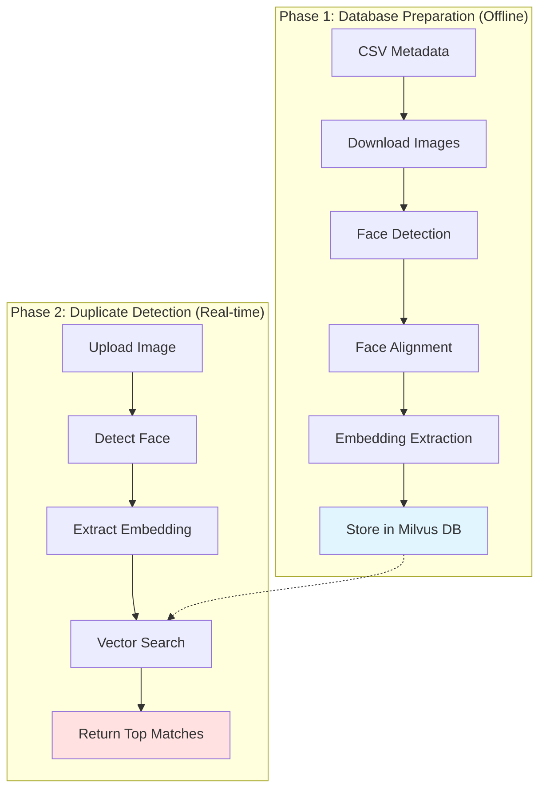

# Face Matcher - Duplicate Account Detection

A face matching MVP for duplicate account detection using face embeddings and vector similarity search with Milvus Lite.

## Demo

🚀 **Try the live demo**: [https://huggingface.co/spaces/pray/face_matching_mvp](https://huggingface.co/spaces/pray/face_matching_mvp)

<div align="center">
  
</div>

*Upload an image to find potential duplicate accounts based on facial similarity*

---

## 🔄 How It Works

### System Overview

The Face Matcher system operates in two phases: **Database Preparation** (offline) and **Duplicate Detection** (real-time).



### 📊 Database Preparation Flow

**One-time setup to populate the database with known faces:**

```
┌─────────────────┐
│ 1. CSV Metadata │ (name, image_url, image_id)
└────────┬────────┘
         │
         ▼
┌─────────────────┐
│ 2. Download     │ → downloads/Adam_Brody_360.jpg
│    Images       │
└────────┬────────┘
         │
         ▼
┌─────────────────┐
│ 3. Face         │ RetinaFace/Haar Cascade
│    Detection    │ → Detect face regions
└────────┬────────┘
         │
         ├──► cropped_faces/Adam_Brody_360_crop.jpg (original face crop)
         │
         ▼
┌─────────────────┐
│ 4. Face         │ Normalize to 112×112
│    Alignment    │ → aligned_faces/Adam_Brody_360_aligned.jpg
└────────┬────────┘
         │
         ▼
┌─────────────────┐
│ 5. Embedding    │ MobileFaceNet (ONNX)
│    Extraction   │ → 128-dim vector
└────────┬────────┘
         │
         ▼
┌─────────────────┐
│ 6. Store in     │ Milvus Lite Database
│    Vector DB    │ → [name, paths, embedding]
└─────────────────┘
```

**Command:**
```bash
python scripts/prepare_database.py --csv facescrub_metadata.csv --detector retinaface
```

---

### 🔍 Duplicate Detection Flow

**Real-time search for similar faces:**

```
┌─────────────────┐
│ User uploads    │
│ selfie image    │
└────────┬────────┘
         │
         ▼
┌─────────────────┐
│ 1. Detect Face  │ RetinaFace/Haar Cascade
│                 │ → Find face region
└────────┬────────┘
         │
         ▼
┌─────────────────┐
│ 2. Align Face   │ Normalize to 112×112
│                 │
└────────┬────────┘
         │
         ▼
┌─────────────────┐
│ 3. Extract      │ MobileFaceNet
│    Embedding    │ → 128-dim query vector
└────────┬────────┘
         │
         ▼
┌─────────────────┐
│ 4. Vector       │ L2 Distance Search
│    Search       │ → Find top-6 similar faces
│  (Milvus Lite)  │
└────────┬────────┘
         │
         ▼
┌─────────────────┐
│ 5. Calculate    │ similarity = 1 - (distance² / 4)
│    Similarity   │
└────────┬────────┘
         │
         ▼
         ├──► If similarity ≥ 60% → 🚨 DUPLICATE DETECTED (red overlay)
         │
         └──► If similarity < 60% → ✅ NO DUPLICATE FOUND
```

**Threshold:** Configurable in `config.py` (default: 60%)

---

### 🏗️ System Architecture

```
┌──────────────────────────────────────────────────────────────┐
│                     Gradio Web Interface                     │
│                    (gradio_app.py)                           │
└───────────────┬──────────────────────────────┬───────────────┘
                │                              │
                ▼                              ▼
    ┌───────────────────────┐      ┌─────────────────────────┐
    │  Face Detection       │      │  Face Recognition       │
    │  (detection.py)       │      │  (recognition.py)       │
    │                       │      │                         │
    │  • RetinaFaceDetector │      │  • FaceEmbeddingExtractor│
    │  • HaarCascadeDetector│      │  • MobileFaceNet (ONNX) │
    └───────────────────────┘      └─────────────────────────┘
                │                              │
                └──────────────┬───────────────┘
                               │
                               ▼
                   ┌───────────────────────┐
                   │   Vector Database     │
                   │   (database.py)       │
                   │                       │
                   │   • Milvus Lite       │
                   │   • IVF_FLAT Index    │
                   │   • L2 Distance       │
                   └───────────────────────┘
                               │
                               ▼
                   ┌───────────────────────┐
                   │  milvus_face_data.db  │
                   │  (128-dim embeddings) │
                   └───────────────────────┘
```

**Key Components:**
- **Gradio UI**: Web interface for image upload and results display
- **Detection Module**: Face detection using RetinaFace or Haar Cascade
- **Recognition Module**: Embedding extraction using MobileFaceNet
- **Database Module**: Vector storage and similarity search with Milvus Lite

---

## Project Structure

```
face_matching_mvp/
├── src/
│   └── face_matcher/           # Main package
│       ├── core/               # Core business logic
│       │   ├── detection.py    # Face detection
│       │   ├── recognition.py  # Face embedding extraction
│       │   └── database.py     # Vector database operations
│       ├── ui/
│       │   └── gradio_app.py   # Gradio web interface
│       ├── utils/
│       │   └── logging.py      # Logging utilities
│       └── config.py           # Configuration management
│
├── scripts/
│   ├── prepare_database.py     # Database preparation script
│   └── run_app.py              # Application launcher
│
├── tests/                      # Test suite
│   ├── test_detection.py
│   ├── test_recognition.py
│   └── test_database.py
│
├── data/                       # Data directory
│   ├── downloads/              # Downloaded images
│   ├── aligned_faces/          # Aligned face crops (for embeddings)
|   ├── cropped_faces/          # Original face crops (for display)
│   └── milvus_face_data.db     # Faces database in Milvus     
|   
│
├── models/
│   └── MobileFaceNet.onnx     # Face embedding model
│
├── pyproject.toml              # Modern Python packaging
├── setup.py                    # Package setup
├── requirements.txt            # Python dependencies
├── requirements-dev.txt        # Development dependencies
```

## Installation

### Prerequisites

- Python 3.11
- pip or uv package manager

### Setup

1. **Clone the repository:**
   ```bash
   cd face_matching_mvp
   ```

2. **Create virtual environment:**
   ```bash
   python -m venv .venv
   source .venv/bin/activate  # On Windows: .venv\Scripts\activate
   ```

3. **Install dependencies:**
   ```bash
   # Using pip
   pip install -r requirements.txt

   # Or using uv (faster)
   uv pip install -r requirements.txt
   ```

4. **Install package in editable mode (optional) or if you want to run test:**
   ```bash
   pip install -e .
   ```

## Quick Start

### 1. Prepare the Database

Download images, detect faces, extract embeddings, and populate the vector database:

```bash
python scripts/prepare_database.py \
    --csv facescrub_metadata.csv \
    --max_images 100 \
    --detector retinaface \
    --reset_database
```

**Options:**
- `--csv`: Path to metadata CSV file (default: facescrub_metadata.csv)
- `--max_images`: Maximum number of images to process (optional)
- `--detector`: Face detector to use (`retinaface` or `haarcascade`)
- `--reset_database`: Drop existing collection and create new one
- `--skip_existing`: Skip processing if face already exists (default: True)

### 2. Launch the Web Interface

```bash
python scripts/run_app.py
```

The Gradio interface will be available at `http://localhost:7860`

**Alternative (if installed with pip install -e .):**
```bash
face-matcher-prepare --max_images 100 --detector retinaface
face-matcher-app
```

## Usage

### Web Interface

1. **Upload** a selfie image
2. **Select** face detector (RetinaFace or Haar Cascade)
3. **Click** "Search for Matches"
4. **Review** results:
   - Status: Duplicate Detected / No Duplicate Found
   - Similarity score of best match
   - Top 6 similar faces with confidence scores

### Configuration

Edit `src/face_matcher/config.py` to customize settings:

```python
@dataclass
class AppConfig:
    """Application configuration"""
    host: str = "0.0.0.0"
    port: int = 7860
    share: bool = False
    similarity_threshold: float = 0.5  # Duplicate detection threshold (0.0-1.0)
    top_k_results: int = 6             # Number of similar faces to return

@dataclass
class DatabaseConfig:
    """Database configuration"""
    db_path: str = str(PROJECT_ROOT / "data/milvus_face_data.db")
    collection_name: str = "face_embeddings"
```

All configuration is centralized in `config.py` - no environment variables needed!

## Development

### Running Tests

```bash
# Install development dependencies
pip install -r requirements-dev.txt

# Run tests (make sure to run pip install -e .)
pytest

# Run tests with coverage
pytest --cov=src/face_matcher --cov-report=html
```

### Code Quality

```bash
# Format code
black src/ scripts/ tests/

# Sort imports
isort src/ scripts/ tests/

# Type checking
mypy src/

# Linting
flake8 src/ scripts/ tests/
```

## Architecture

### Data Pipeline

1. **Image Download**: Fetch images from URLs in metadata CSV
2. **Face Detection**: Detect faces using RetinaFace or Haar Cascade
3. **Face Alignment**: Normalize faces to 112x112 for embedding extraction
4. **Embedding Extraction**: Generate 128-dim embeddings using MobileFaceNet
5. **Vector Storage**: Store embeddings in Milvus Lite with L2 index

### Core Components

- **Face Detection**: `RetinaFaceDetector`, `HaarCascadeDetector`
- **Face Recognition**: `FaceEmbeddingExtractor` (ONNX inference)
- **Vector Database**: `VectorDatabase` (Milvus Lite wrapper)
- **Web Interface**: `FaceMatchingApp` (Gradio application)

### Similarity Metric

- **Embedding**: 128-dimensional L2-normalized vectors
- **Distance**: L2 (Euclidean) distance
- **Similarity**: Converted from L2 distance: `similarity = 1 - (distance^2 / 4)`
- **Threshold**: Default 0.5 (50% similarity)

## Performance

- **Embedding Extraction**: ~10-20ms per face (CPU)
- **Vector Search**: <10ms for 1000+ faces (Milvus Lite)
- **Face Detection**:
  - RetinaFace: ~100-200ms (more accurate)
  - Haar Cascade: ~20-50ms (faster)

## Troubleshooting

### Database Reset

If you encounter database errors:

```bash
# Delete database file
rm -f ./data/milvus_face_data.db

# Recreate database
python scripts/prepare_database.py --reset_database
```

### Import Errors

If you get import errors, ensure the package is installed:

```bash
pip install -e .
```

Or add the src directory to PYTHONPATH:

```bash
export PYTHONPATH="${PYTHONPATH}:$(pwd)/src"
```

### Model Not Found

Ensure `MobileFaceNet.onnx` is in the `models/` directory.

## License

MIT License

## Contributing

1. Fork the repository
2. Create a feature branch
3. Make your changes
4. Add tests
5. Submit a pull request

## Acknowledgments

- **MobileFaceNet**: Lightweight face recognition model
- **RetinaFace**: State-of-the-art face detection
- **Milvus**: Open-source vector database
- **Gradio**: Easy-to-use web interface framework
